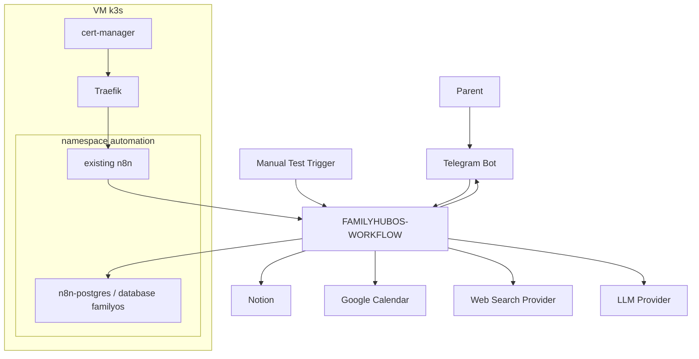
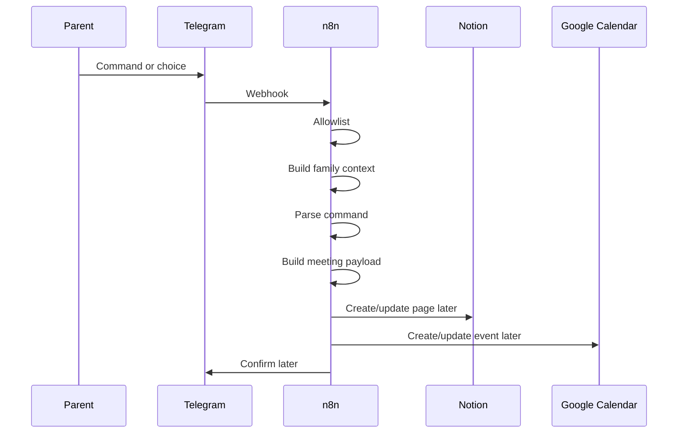

# FamilyHubOS - Architecture

## Current Infrastructure

FamilyHubOS integrates with the existing DevOps lab instead of deploying duplicate infrastructure:

- Ubuntu VM `51.210.40.78`
- k3s
- Traefik in `kube-system`
- cert-manager with Let's Encrypt
- namespace `automation`
- existing n8n instance
- existing `n8n-postgres`

## Principles

- Build one working path before splitting anything.
- Keep the parent in the loop for important choices.
- Never present important medical, educational or developmental information without reliable sources.
- Never store secrets in Git.
- Let Notion own business memory and PostgreSQL own technical state.
- Keep providers replaceable: LLM, web search, calendar and notifications.

## Target Diagram

## Domain Boundaries

Domain:

- Topic
- Meeting
- Source
- Decision
- Feedback

Application:

- Plan meeting
- Research topic
- Create meeting
- Review decision

Infrastructure:

- Telegram
- Notion
- Google Calendar
- Web Search
- LLM
- PostgreSQL

## Data Ownership

Notion owns:

- Meetings
- Topics
- Sources
- Decisions
- Feedbacks
- Human notes

PostgreSQL owns:

- Workflow runs
- Workflow errors
- Conversation states
- Idempotency keys
- Research cache

Google Calendar owns:

- Meeting event scheduling
- Preparation reminders when enabled

Telegram owns no durable business data. It is only an interaction channel.

## First Flow

## Risks

- n8n can become hard to maintain if too much logic accumulates.
- Search results can be weak or SEO-heavy.
- Retries can create duplicates without idempotency.
- Telegram bots can expose functionality without allowlists.
- Sharing `n8n-postgres` couples FamilyHubOS to automation infrastructure.

## Mitigations

- Keep one workflow while it is understandable, then split only specific painful sections.
- Validate sources explicitly.
- Use stable IDs for meetings, events, notifications and callbacks.
- Reject unauthorized Telegram users and chats before any action.
- Use a dedicated `familyos` database and avoid n8n internal tables.
