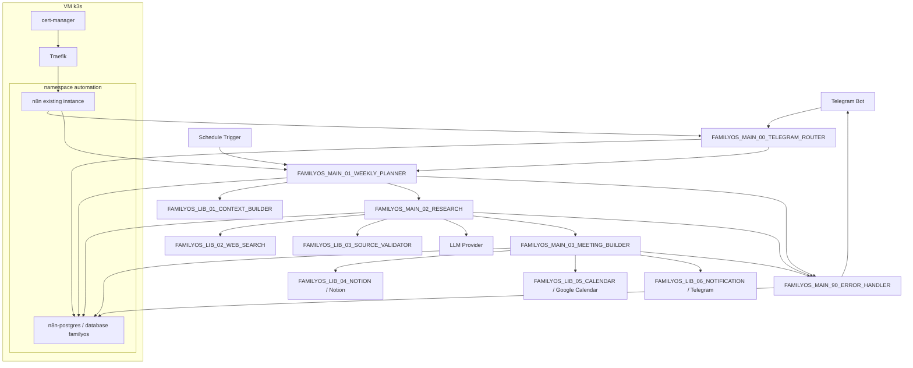
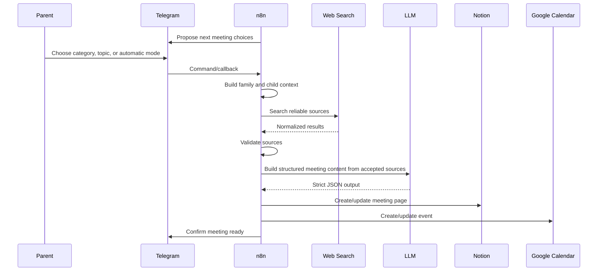

# FamilyOS - Architecture

## Current State

Le repository ne contient pas encore de workflow n8n, de configuration Notion, de configuration Google Calendar ou de schéma PostgreSQL FamilyOS.

La VM cible existe déjà :

- Ubuntu `51.210.40.78`.
- k3s.
- Traefik dans `kube-system`.
- cert-manager avec Let's Encrypt.
- namespace `automation` avec `n8n`, `n8n-postgres`, Ingress Traefik et certificat HTTPS.

FamilyOS doit donc s'intégrer à l'infrastructure existante au lieu de créer un nouveau déploiement n8n.

## Principles

- Construire une V1 simple qui fonctionne de bout en bout.
- Garder l'utilisateur dans la boucle pour les choix importants.
- Ne jamais présenter une information médicale, éducative ou développementale importante sans source fiable.
- Ne jamais stocker de secrets dans Git.
- Éviter la duplication : Notion garde le métier, PostgreSQL garde la technique.
- Préserver la possibilité de remplacer le LLM ou le moteur de recherche.

## Target Diagram

## Domain Boundaries

Domain :

- Topic
- Meeting
- Source
- Decision
- Feedback

Application :

- PlanMeeting
- ResearchTopic
- CreateMeeting
- ReviewDecision

Infrastructure :

- Telegram
- Notion
- Google Calendar
- Web Search
- LLM
- PostgreSQL

## Data Ownership

Notion owns :

- Meetings
- Topics
- Sources
- Decisions
- Feedbacks
- Human notes

PostgreSQL owns :

- Workflow runs
- Workflow errors
- Conversation states
- Idempotency keys
- Research cache

For the MVP, these technical tables live in a dedicated PostgreSQL database named `familyos` on the existing `n8n-postgres` instance.

Google Calendar owns :

- Meeting event scheduling
- Preparation reminders when enabled

Telegram owns no durable business data. It is an interaction channel.

## MVP Flow

## Recommended Technical Choices

- Reuse the existing n8n instance in the Kubernetes namespace `automation`.
- Reuse the existing PostgreSQL instance `n8n-postgres`.
- Create a dedicated database `familyos` for FamilyOS technical tables.
- Notion databases for human-facing data.
- Google Calendar for scheduling.
- Telegram Bot API with private group allowlist.
- JSON schemas for structured LLM outputs.
- Configurable source scoring thresholds.

## Risks

- Source quality can degrade if the search provider returns SEO-heavy results.
- n8n workflows can become hard to maintain if business logic is duplicated.
- Calendar and Notion retries can create duplicates without idempotency.
- Telegram bots can leak functionality if user/chat allowlists are missing.
- Sharing the `n8n-postgres` instance can couple FamilyOS availability to automation infrastructure.

## Mitigations

- Use source tiers and explicit validation.
- Keep reusable logic in sub-workflows.
- Use stable IDs for meetings, events, notifications and callbacks.
- Reject unauthorized Telegram users and chats before any action.
- Isolate FamilyOS tables in the `familyos` database and avoid writing into n8n internal tables.
- Add backup coverage for `familyos` before relying on it for important state.

